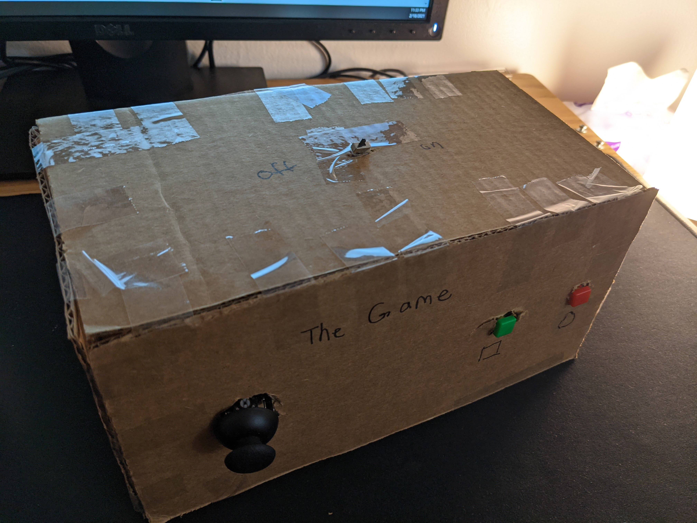

# Module 2: Interactive Art

In this project, I made a game in which the player controls a triangle that is tasked with fitting into a world
full of squares and circles. If the player touches another shape or does not change shapes fast enough, the player
will be noticed and the game ends. The game uses two buttons, one switch, and one joystick, all of which I acquired
from the ESP32 kit. These hardware components were connected to the ESP32 Wrover module, which would use
Serial communication to send the player's input signals to a Raspberry Pi. The Pi provided power and allowed actually ran the game, which was written and displayed using Processing.

## Hardware Configuration
Joystick was wired according to Freenove_Ultimate_Starter_Kit_for_ESP32 Chapter 14. Buttons were wired with one end connected to an IO pin and one end to ground. The switch was wired similarly with middle pin connected to ground and
an end pin connected to an IO pin. ESP32 Wrover was mounted on a GPIO extension board and a breadboard.

## ESP32 Wrover Software
This code was written and flashed to ESP32 Wrover unit using Arduino IDE. The code is in `sketch_feb05a/`. 
The code simply reads input signals and writes it to Serial port.

## Pi Software
Pi code (`game_of_life/`) was written in Processing and based off of the Simple Read example, which showed 
how to read from a Serial port. The code has 4 states: home screen, in-game, and two end-game screens 
(one for not conforming  and one for touching another shape). In first state, program will show a home screen 
and will switch to in-game state if switch is flipped. At any time, if switch is flipped back, game returns 
to home screen. If player loses game, then the appropriate end-game screen is shown. The bouncing circles and 
squares that randomly switch are defined in NPC class in `npc.pde`.

To run processing program on boot, I put `processing-java --sketch="path/to/game_of_life --run` in `~/.config/lxsession/LXDE-pi/autostart`. It was important to put this line at a point in boot process where pi had opened monitor.

## Pictures and video
[Video](https://youtu.be/lpxDvUm7lwg) of demo

Enclosure

Hardware configuration

