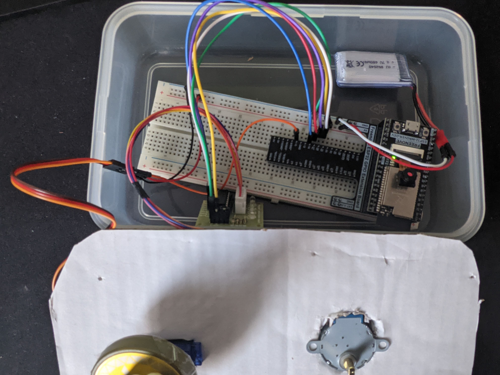

# Module 4: Kinetic Sculpture 

This project builds a display platform for my Amiibo (Nintendo figurines).
It can be controlled over WIFI via a website: to start the sculpture, press the button 
at [http://165.227.76.232:3000/km3290](http://165.227.76.232:3000/km3290]).
When the sculpture is running, both motors begin rotating
180 degrees back and both (simultaneously). Unfortunately, I was unable to
attach a second figurine to the second motor because it did not come with
a shaft attachment that would allow me to easily tape the shaft to the figurine.

## Hardware Configuration
Components
- Servo Motor
- Stepper Motor
- ESP 32 Wrover
- 9V LiPo battery (3.7V 650 mAh)

Servo Motor was wired according to Freenove_Ultimate_Starter_Kit_for_ESP32 Chapter
Chapter 18 and the Stepper Motor was wired according to Chapter 19. I was able 
to attach an amiibo to the servo motor because the shaft came with plastic 
attachments, which I could then tape to the base of the amiibo.
The ESP32 Wrover was mounted on a GPIO extension board and I shifted the extension board down on the breadboard so that it would fit inside my enclosure. 
My enclosure was a plastic container with cardboard covering with holes 
cut out for the two motors.

## Software Configuration
This code was written and flashed to ESP32 Wrover unit using Arduino IDE. 
The code is in `sketch_mar24a/` and used the code from that textbook chapters 18 
and 19 as reference. The code uses WiFi library to connect to Columbia's wifi, HTTPClient to send GET requests to check status of webserver, and ESP32Servo to control the servo motor. 

## Pictures and video
[Video](https://youtu.be/MFyOs3ibuYE) of demo

Hardware configuration

