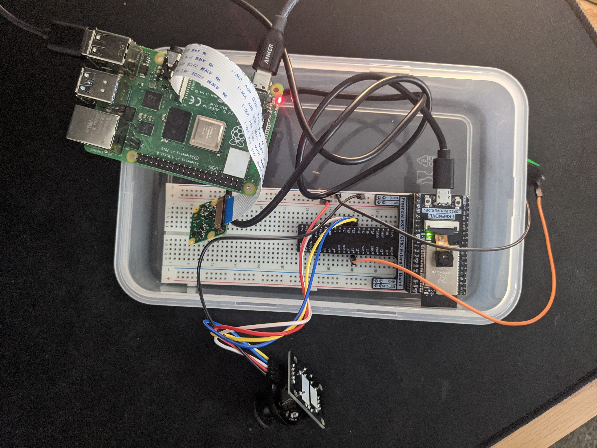

# Module 5: Final Project

This project builds a mood-controlled music player. It uses a Raspberry Pi and a camera attachment to take a picture of the user 
and then run Google Cloud computer vision to classify the emotion of the user (happy, sad, angry, surprised, and neutral). The Pi then
plays music it has downloaded via a bluetooth speaker. In the case where the model might have misinterpreted the user's facial expression
or if the user wishes to adjust the mood without taking another picture, the user can press the green button while tilting the joystick
to change moods. Left, right, up and down correspond to angry, surprised, happy, and sad.

## Hardware Configuration
Components
- Raspberry Pi 4B
- [Raspberry Pi Camera Module](https://www.raspberrypi.org/products/camera-module-v2/)
- ESP32 Wrover
- Joystick
- Button
- JBL Charge Bluetooth Speaker

## Software Configuration
The ESP32 was used to grab user input (`user_input/`) and its code was written and flashed to ESP32 Wrover unit using Arduino IDE. 
It reads joystick and button signals and writes data to its Serial port, which the python script on the Pi reads. The Python script is in an infite loop
that reads these inputs, and if it detects a button press, it determines an emotion (either by taking a picture or using joystick input)
and begins to play music via VLC, the multimedia software that comes with Raspberry Pi. 

## Pictures and video

Hardware configuration

